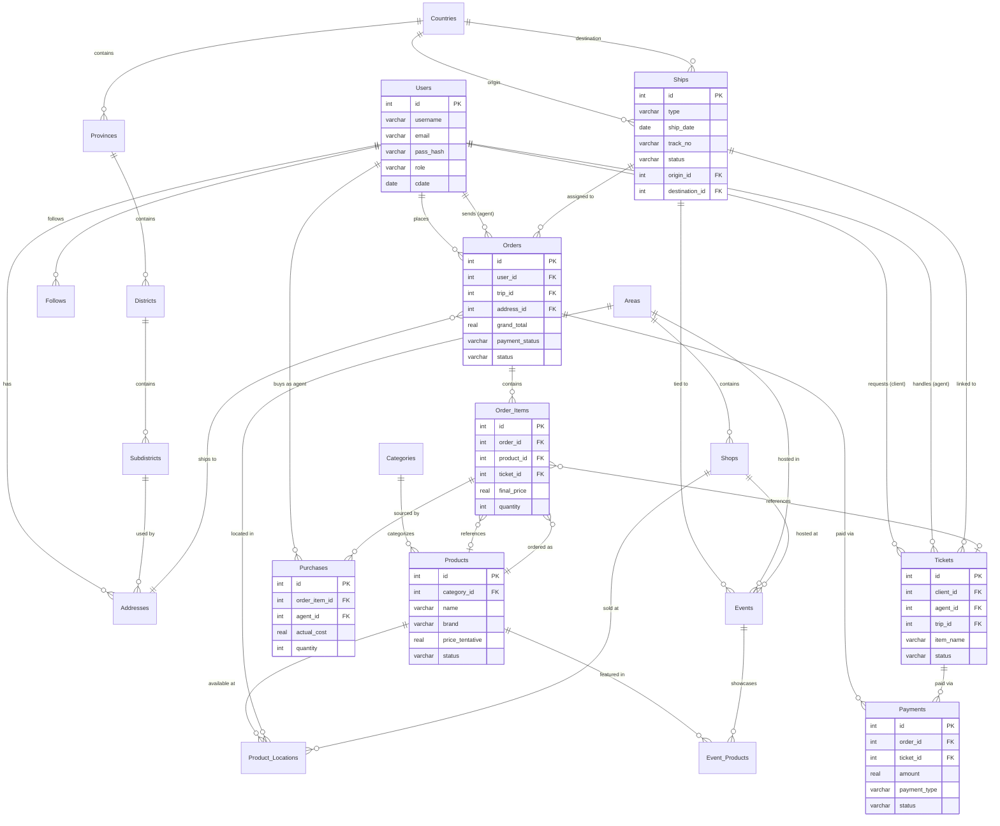

# 🇯🇵 NihonThing - Japan Import Goods Platform


A comprehensive e-commerce and logistics platform for pre-ordering and managing the shipment of goods from Japan to Thailand.

Users can browse products, create custom item requests (tickets), place orders tied to specific shipping trips, and track deliveries - all powered by role-based access control for Admins, Agents, and Clients.

## Key Features

| Feature | Description |
|---------|-------------|
| 🔐 **JWT Authentication** | Salted SHA-256 password hashing via WebCrypto API - zero external dependencies |
| 🛡️ **Role-Based Access (RBAC)** | Middleware-enforced route protection for Admin, Agent, and Client roles |
| 📖 **Auto-Generated API Docs** | Live Swagger UI - routes, schemas, and auth are auto-generated from Zod + OpenAPI |
| 🗄️ **Type-Safe Database** | Drizzle ORM with full relation definitions - schema-as-code with auto-generated SQL migrations |
| ✈️ **Trip-Based Logistics** | Orders and tickets tied to shipping trips with capacity limits (FCFS queue system) |
| 🎫 **Custom Request System** | Ticket workflow for sourcing unlisted items - negotiation, agent assignment, and price proposal |
| 🌏 **Multi-Language Ready** | Geographic data (Areas, Shops, Addresses) supports Thai, English, and Japanese names |

## ER Diagram



## Project Structure

```
NihonThing/
├── docs/                              # Documentation & design
│   ├── REQUIREMENTS.md                # Full platform requirements (PRD)
│   ├── PLAN.md                        # Development roadmap & milestones
│   └── DBdesign.md                    # Database schema (DBML for dbdiagram.io)
│
├── server/                            # Backend API (Cloudflare Workers + Hono)
│   ├── migrations/                    # Auto-generated SQL migration files
│   ├── src/
│   │   ├── index.ts                   # App entry point, route registration, Swagger setup
│   │   ├── db/
│   │   │   └── schema.ts             # Drizzle ORM tables, columns & relation definitions
│   │   ├── routes/                    # OpenAPI route handlers (Controllers)
│   │   ├── services/                  # Business logic layer
│   │   ├── middlewares/               # JWT verification & RBAC guard
│   │   ├── models/                    # Zod schemas & data access helpers
│   │   └── utils/                     # Shared helper functions
│   │
│   ├── drizzle.config.ts             # Drizzle Kit configuration
│   ├── wrangler.jsonc                 # Cloudflare Workers & D1 binding config
│   └── package.json
│
├── LICENSE
├── README.md
└── .gitignore
```

<p align="center">
  <sub>Built for a seamless Japan-to-Thailand shopping experience 🛒✈️🇹🇭</sub><br>
  <sub>Copyright © 2026 LunarLight-cn · All Rights Reserved</sub>
</p>
