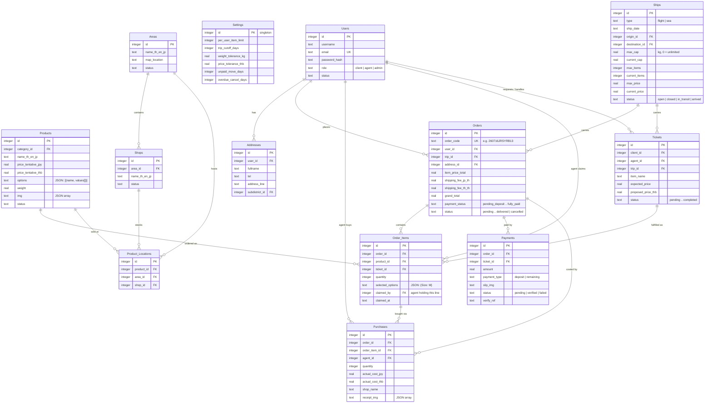

# NihonThing - Japan Import Goods Platform

[](https://github.com/LunarLight-cn/NihonThing/actions/workflows/ci.yml)


A full-stack pre-order and logistics platform for shipping goods from Japan to Thailand - from browsing the catalog to the parcel arriving at the customer's door.

Customers browse products or request unlisted items, place orders tied to a specific **shipping trip**, and pay a deposit via PromptPay QR with automatic slip verification. **Agents** in Japan work a shopping queue: claim order lines, buy them in stores, and record real costs with receipts. **Admins** run the whole pipeline - trips, capacity, dispatch, payments, and platform rules.

## Key Features

| Feature | Description |
|---------|-------------|
| 🔐 **JWT Auth + PBKDF2** | Passwords hashed with PBKDF2 (SHA-256, 100k iterations) via WebCrypto - zero external crypto dependencies |
| 🛡️ **Three-Role RBAC** | `admin` / `agent` / `client` enforced by middleware guards on every route, with field-level filtering where roles overlap |
| ✈️ **Three-Axis Trip Capacity** | Trips close on item count, weight, or order value - whichever fills first. Concurrent orders can't oversell: capacity is claimed by a guarded SQL `UPDATE`, not checked in app code |
| 🛒 **Agent Shopping Queue** | Agents claim order lines (two agents can split one order), record actual costs against each line, and see money-in vs money-out per order |
| 🚢 **Shipping Dispatch Board** | Depart/arrive a trip and cascade its orders; unpaid orders auto-move to the next trip or get cancelled after a configurable deadline - never deleted |
| 💸 **PromptPay + Slip Verify** | Deposit and balance payments by QR, with the uploaded bank slip verified against the expected amount via an external API |
| 🎫 **Custom Requests** | Ticket workflow for sourcing unlisted items - quote, negotiation, agent assignment |
| 📖 **Auto-Generated API Docs** | Live Swagger UI - routes, schemas, and auth generated from Zod + OpenAPI definitions |
| 🌏 **Full i18n** | Complete English, Thai, and Japanese UI via i18next; catalog and geo data carry `name_th/en/jp` columns |
| ⚙️ **Admin-Tunable Rules** | Per-user order limits, capacity tolerances, payment deadlines - all editable in the dashboard, no redeploy |
| 🚀 **CI/CD on Free Tier** | GitHub Actions: every PR is linted and built; pushes to `staging`/`master` migrate D1 and deploy separate Workers |

## Architecture

Two independent packages, deployed separately:

- **`server/`** - Cloudflare Workers + Hono (OpenAPIHono). Drizzle ORM over Cloudflare D1 (SQLite), R2 for file storage served back through the Worker (the bucket is never public). Uploads are validated by size, type, extension **and magic bytes**.
- **`client/`** - React 19 + Vite SPA. TanStack Query for server state, react-router v7, Tailwind with a component-class design system, i18next for the three languages.

D1 has no interactive transactions, so every race-sensitive write (trip capacity, line claiming) is a single guarded `UPDATE ... WHERE` - the losing request matches zero rows instead of corrupting state.

## ER Diagram



Geo hierarchy (`Countries → Provinces → Districts → Subdistricts`) and the Events/Follows tables are omitted here for readability - the full schema lives in [`server/src/db/schema.ts`](server/src/db/schema.ts).

## Order Lifecycle

Fulfillment and payment are **two independent axes** - a customer can pay the balance before or after the trip departs, so they are never merged into one status:

```
fulfillment:  pending → purchasing → in_transit → arrived → local_shipping → delivered
payment:      pending_deposit → deposit_paid → pending_remaining → fully_paid
```

The rules that connect them are enforced server-side:

- An agent cannot claim or buy for an order until its **deposit is paid**.
- An order cannot go `in_transit` until it is **fully paid** - unpaid goods don't leave the country.
- Unpaid orders are **moved to the next trip** N days before departure, and **cancelled (never deleted)** after sitting unpaid past the deadline. Both windows are admin-configurable.

## Project Structure

```
NihonThing/
├── .github/workflows/       # CI (lint + build on PRs), staging & production deploys
│
├── client/                  # React 19 + Vite SPA (Cloudflare Pages)
│   └── src/
│       ├── pages/           # customer / admin / agent page trees
│       ├── components/      # layouts (shared dashboard shell), UI building blocks
│       ├── contexts/        # Auth, Cart
│       ├── locales/         # en / th / jp translations (complete)
│       └── utils/           # localization, status colours, image helpers
│
└── server/                  # Hono API on Cloudflare Workers
    ├── migrations/          # Drizzle-generated SQL, applied by CI
    └── src/
        ├── db/schema.ts     # Single source of truth for the database
        ├── routes/          # OpenAPI route definitions (one per entity)
        ├── models/          # Data access, one file per entity
        ├── middlewares/     # authGuard / roleGuard / adminGuard, CORS
        └── utils/           # PBKDF2 hashing, file validation (magic bytes)
```

## Running Locally

```bash
# API - http://localhost:8787, Swagger UI at /ui
cd server
npm install
npx wrangler d1 migrations apply nihonthing_db --local
npm run dev

# Web - http://localhost:5173
cd client
npm install
npm run dev
```

## Deployment

Everything runs on Cloudflare's free tier:

- **Client** → Cloudflare Pages (Git integration: `master` = production, other branches = preview)
- **Server** → two separate Workers (`nihonthing-api`, `nihonthing-api-staging`) with their own D1 databases
- **CI/CD** → GitHub Actions validates every PR, then on push builds first, applies D1 migrations, and deploys - a broken build stops before the schema moves

<p align="center">
  <sub>Built for a seamless Japan-to-Thailand shopping experience 🛒✈️🇹🇭</sub><br>
  <sub>Copyright © 2026 LunarLight-cn · All Rights Reserved</sub>
</p>
